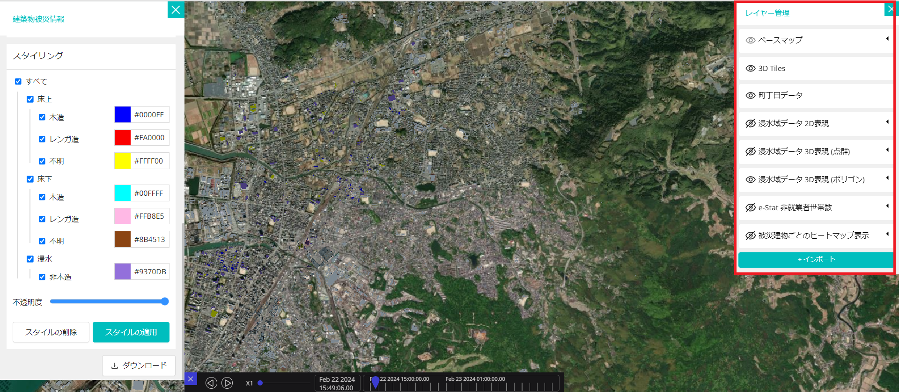

# インストール手順書

# 1 本書について

本書では、SAR衛星解析による洪水被害の推定結果の可視化を行うRe:Earthプラグイン（以下「本システム」という。）の利用環境構築手順について記載しています。本システムの構成や仕様の詳細については以下も参考にしてください。

[技術検証レポート](https://www.mlit.go.jp/XXX)

# 2 動作環境

本システムの動作環境は以下のとおりです。

| 項目               | 最小動作環境                                                                                                                                                                                                                                                                                                                                    | 推奨動作環境                   | 
| ------------------ | ----------------------------------------------------------------------------------------------------------------------------------------------------------------------------------------------------------------------------------------------------------------------------------------------------------------------------------------------- | ------------------------------ | 
| OS                 | Webブラウザが動作する全てのデスクトップOS（Windows, macOS, Linux, Chrome OS）やモバイルOS（iOS、Andorid）に対応                                                                                                                                                                                                                                                                                                                |  同左 | 
| 対応ブラウザ       | Chrome 58_   Firefox 57+   Safari 11+（macOSのみ）   Microsoft Edge XX 以降   iOS(11+) Safari   Android(10+) Chrome                                                                                                                                                                                                                                                                                                                               |  同左  | 
| ディスプレイ解像度 | 1000×700以上                                                                                                                                                                                                                                                                                                                                    |  同左                   | 
| ネットワーク       | 必要 |  同左                            | 

# 3 インストール手順

[こちら](https://github.com/Project-PLATEAU/reearth-plugin-flooddamage-widget/releases/)
から本システムをダウンロードします。

ダウンロード後、プラグインをインストールしたいRe:Earthのプロジェクトを開きます。
画面上部のRe:Earthのプロジェクト名をクリックし、プラグインの設定画面を開きます。

個人インストール済みタブを押下し、PCからZipファイルをアップロードからダウンロードしたZipファイルを選択します。
インストール済みにプラグインがインストールされていれば、プラグインのインストールは完了です。

# 4 準備物一覧

アプリケーションを利用するために以下のデータを入手します。

|             | データ種別                                                                                                                                                             | 機能                     | 用途                 | 入力方法                                   |
| ----------- | ---------------------------------------------------------------------------------------------------------------------------------------------------------------------- | ------------------------ | -------------------- | ------------------------------------------ |
| ①          | 3D都市モデル(CityGML)G空間情報センターから取得します。 https://front.geospatial.jp/                                                                                 | 全般                     | 全般                 | 3DTilesのtileset.jsonのURLを指定           |
| ②          | 建物被災状況　SAR衛星解析による洪水被害の推定システムから取得します。 https://github.com/Project-PLATEAU/SAR-image-based-flood-damage-detector                      | 全般                     | 全般                 | CSVファイルのURLを指定                     |
| ③          | 3D浸水域・浸水深の画像タイル　SAR衛星解析による洪水被害の推定システムから取得します。 https://github.com/Project-PLATEAU/SAR-image-based-flood-damage-detector      | レイヤー管理ウィジェット | データの表示／非表示 | 画像タイルのURLを指定                      |
| ④          | 浸水域・浸水深の3Dタイルデータ　SAR衛星解析による洪水被害の推定システムから取得します。 https://github.com/Project-PLATEAU/SAR-image-based-flood-damage-detector    | レイヤー管理ウィジェット | データの表示／非表示 | 3DTilesのtileset.jsonのURLを指定           |
| ⑤          | 被災建物のヒートマップ画像タイル　SAR衛星解析による洪水被害の推定システムから取得します。 https://github.com/Project-PLATEAU/SAR-image-based-flood-damage-detector  | レイヤー管理ウィジェット | データの表示／非表示 | 画像タイルのURLを指定                      |
| ⑥          | 町丁目データ e-Statから取得します。 https://www.e-stat.go.jp/help/view-on/map/boundary_data                                                                         | 全般                     | 全般                 | Re:Earthのアセットに登録してファイルを指定 |
| ⑦          | 非就業者世帯数の分布 e-Statから取得します。 https://www.e-stat.go.jp/                                                                                               | レイヤー管理ウィジェット | データの表示／非表示 | Re:Earthのアセットに登録してファイルを指定 |

本システムでは、3D都市モデルの建築物モデルの形状（LOD1）と属性を活用します。

| 地物       | 地物型            | 属性区分 | 属性名                                 | 内容                 |
| ---------- | ----------------- | -------- | -------------------------------------- | -------------------- |
| 建築物LOD1 | bldg:Building     | 主題属性 | bldg:measuredHeight                    | 計測高さ             |
|            |                   |          | uro:buildingID                         | 建物ID               |
|            |                   |          | uro:buildingStructureType              | 構造種別             |
|            |                   | 空間属性 | bldg:lod1Solid                         | 建築物のLOD1の立体   |