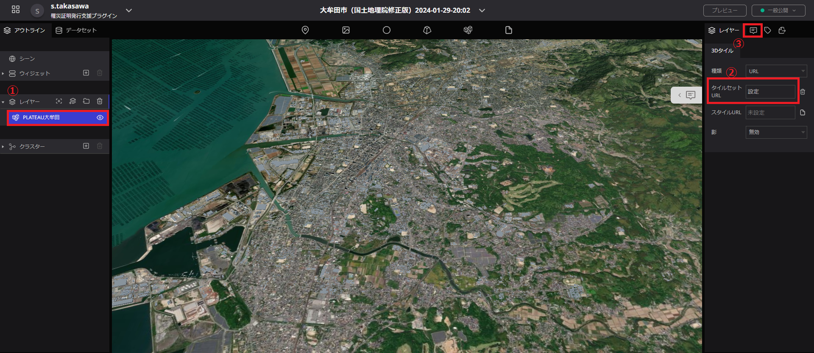
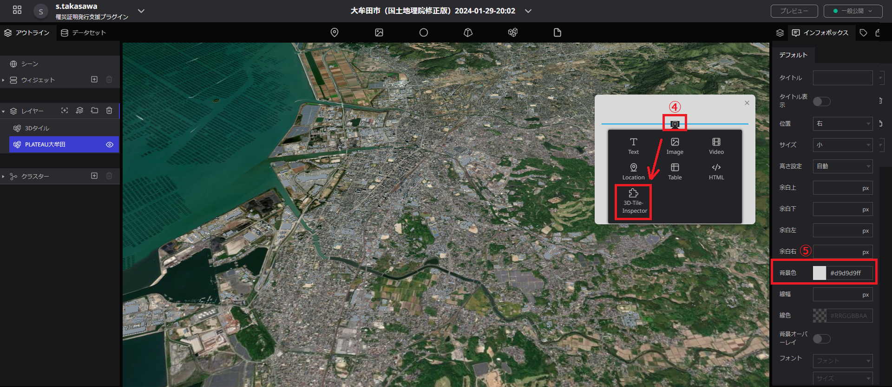
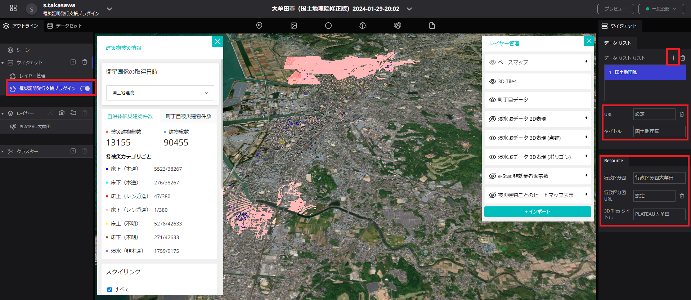
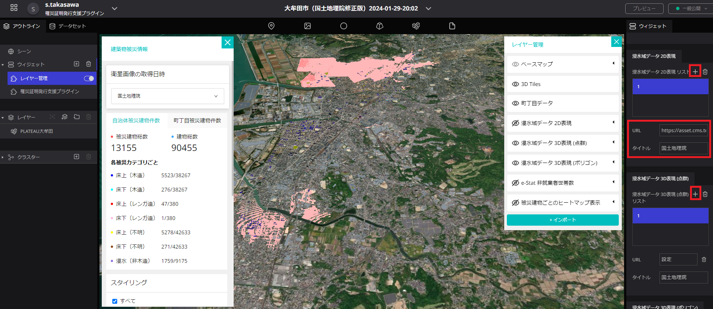

# 操作マニュアル

# 1 本書について

本書では、SAR衛星解析による洪水被害の推定結果の可視化を行うRe:Earthプラグイン（以下「本システム」という。）の操作手順について記載しています。

# 2 使い方

## 2-1 シーンの編集

本システムを利用するにあたり、Re:Earthのシーンの編集を行います。
シーンをクリックすることにより画面右側でシーンの設定が行える。
地形をON、種類を「Cesium Ion」にし、Cesium IonアセットIDとCesium Ionアクセストークンを入力する。
[PLATEAU-Terrainの配信チュートリアル](https://github.com/Project-PLATEAU/plateau-streaming-tutorial/blob/main/terrain/plateau-terrain-streaming.md)から、アクセストークン及びアセットIDを取得することができる。
先進的機能を使用をONにする。

## 2-2 3D都市モデルの追加・設定

① 3D都市モデルレイヤーの追加
・画面上部の3D都市モデルのアイコンを地図上へドラッグ＆ドロップすることで3D都市モデルのレイヤーを追加する。

② 3D都市モデルの設定

・レイヤーに3Dタイルが追加されているため、クリックすることでレイヤーの設定が行える。
・タイルセットURLから、3D都市モデルのtileset.jsonのURLを入力する。
・インフォボックスの設定を開き、インフォボックスの作成を押下する。
・インフォボックスに3D-Tile Injectorを追加する。
・インフォボックスの背景色を「#d9d9d9ff」に設定する。

## 2-3 ウィジェットの設定

### 2-3-1 ウィジェットの追加

・ウィジェットの「＋」ボタンを押下し、「罹災証明書発行支援プラグイン」ウィジェットと「レイヤー管理」ウィジェットを追加します。

### 2-3-2 「罹災証明書発行支援プラグイン」ウィジェットの設定

① 衛星画像の解析結果のデータ入力

・データリストを追加することで、ダッシュボード部の「衛星画像の取得日時」で選択できる項目を追加する。
・データリストに衛星画像の解析結果のタイトルと建物被災データの入力を行う。

② 被災建物リスト（CSV形式）と3D都市モデルの連動

・行政区分図を追加する。
・行政区分図の名称を設定する。
・3D都市モデルのタイトルを入力する。

## 2-3-3 「レイヤー管理」ウィジェットの設定

① ベースマップの設定とウィジェットのリソース設定
・ベースマップの選択を行えるように、タイルリストを追加する。
・ベースマップとサムネイル画像とタイトルを設定することで、プラグイン上でベースマップの切り替えが行えるようになります。
・3D都市モデルのタイトルを入力する。
・「罹災証明書発行支援プラグイン」ウィジェットで設定した行政区分図の名称を入力する。
・e-Stat非就業者世帯数のデータを設定する。
・解析の対象外とする方位をプルダウンから選択するとともに、解析の対象外とする面積と傾きの基準値をテキストボックスに入力します。

② 表示データの設定

・データリストを追加することで、ダッシュボード部の「衛星画像の取得日時」と連動して表示するデータが切り替えられる。
・衛星画像の解析結果のタイトルとデータを入力する。入力するデータは以下の通りである。
| 名称 | 内容 |
| --- | --- |
| 浸水域2D表現 | 衛星解析によって得られる浸水域のXYZタイルデータ |
| 浸水域3D表現（点群） | 衛星解析によって得られる浸水域の点群の3Dタイルデータ |
| 浸水域3D表現（ポリゴン） | 衛星解析によって得られる浸水域を3Dのポリゴンデータ化したもの |
| 床上(木造)データ | 衛星解析によって得られる床上浸水（木造）のヒートマップ |
| 床下(木造)データ | 衛星解析によって得られる床下浸水（木造）のヒートマップ |
| 木造家屋総数データ | 衛星解析によって得られる木造家屋総数のヒートマップ |

## 2-4 ウィジェットの操作

① 罹災証明書発行プラグインウィジェット

・衛星画像の取得日時で表示する衛星画像を選択できる。
・被災建物総数と建物総数、被災カテゴリ毎の被災建物件数と建物件数が表示される。

・町丁目被災建物件数を押下し、町丁目を選択する。町丁目は検索することもできる。
・選択地域の被災建物総数と建物総数、被災カテゴリ毎の被災建物件数と建物件数が表示される。

・被災カテゴリ毎の色分け設定を編集することができる。
・ダウンロードボタンを押下することで、選択地域別集計データ、建物毎の集計データと、被災カテゴリ毎の色分け設定用のスタイルを保存できる。

② レイヤー管理ウィジェット

・データの表示／非表示が選択できる。
・表示するデータをインポートすることもできる。

# 3 出力データ

出力されるデータは以下のとおりです。

| 機能               | 出力データ               | 内容                                                                                                                   | データ形式 |
| ------------------ | ------------------------ | ---------------------------------------------------------------------------------------------------------------------- | ---------- |
| 罹災証明書発行プラグイン | 選択地域別集計データ     | 選択した地域別の集計データ。                                                           | CSV        |
|                    | 建物毎の集計データ       | 建物毎の属性値が付与された集計データ。                                                                   | CSV    |
|                    | 被災カテゴリ毎の色分け設定用のスタイル | 被災カテゴリ毎の色分け設定用の3DTiles用のスタイルファイル。 | JSON        |

## 3-1 選択地域別集計データ

罹災証明書発行プラグインにより選択した地域別の被災カテゴリ毎の被災被災建物総数が集計されたデータが出力されます。

## 3-2 建物毎の集計データ

罹災証明書発行プラグインにより建物毎の属性値が付与された集計データが出力されます。

## 3-3 被災カテゴリ毎の色分け設定用のスタイル

罹災証明書発行プラグインにより被災カテゴリ毎の色分け設定用の3DTiles用のスタイルファイルが出力されます。

